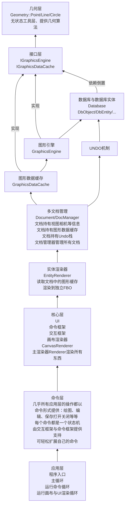

<!-- START doctoc generated TOC please keep comment here to allow auto update -->
<!-- DON'T EDIT THIS SECTION, INSTEAD RE-RUN doctoc TO UPDATE -->
**Table of Contents**  *generated with [DocToc](https://github.com/thlorenz/doctoc)*

- [CAD核心设计](#cad%E6%A0%B8%E5%BF%83%E8%AE%BE%E8%AE%A1)
  - [模块划分](#%E6%A8%A1%E5%9D%97%E5%88%92%E5%88%86)
  - [系统变量](#%E7%B3%BB%E7%BB%9F%E5%8F%98%E9%87%8F)
  - [几何层](#%E5%87%A0%E4%BD%95%E5%B1%82)
  - [CAD特定几何算法](#cad%E7%89%B9%E5%AE%9A%E5%87%A0%E4%BD%95%E7%AE%97%E6%B3%95)
  - [数据库与实体层](#%E6%95%B0%E6%8D%AE%E5%BA%93%E4%B8%8E%E5%AE%9E%E4%BD%93%E5%B1%82)
  - [Undo/Redo设计](#undoredo%E8%AE%BE%E8%AE%A1)
  - [图形引擎与图形数据缓存](#%E5%9B%BE%E5%BD%A2%E5%BC%95%E6%93%8E%E4%B8%8E%E5%9B%BE%E5%BD%A2%E6%95%B0%E6%8D%AE%E7%BC%93%E5%AD%98)
    - [图形数据缓存](#%E5%9B%BE%E5%BD%A2%E6%95%B0%E6%8D%AE%E7%BC%93%E5%AD%98)
    - [初期设计决策](#%E5%88%9D%E6%9C%9F%E8%AE%BE%E8%AE%A1%E5%86%B3%E7%AD%96)
    - [具体设计细节](#%E5%85%B7%E4%BD%93%E8%AE%BE%E8%AE%A1%E7%BB%86%E8%8A%82)
    - [完整的生成与绘制流程设计](#%E5%AE%8C%E6%95%B4%E7%9A%84%E7%94%9F%E6%88%90%E4%B8%8E%E7%BB%98%E5%88%B6%E6%B5%81%E7%A8%8B%E8%AE%BE%E8%AE%A1)
  - [性能测试与优化](#%E6%80%A7%E8%83%BD%E6%B5%8B%E8%AF%95%E4%B8%8E%E4%BC%98%E5%8C%96)
  - [选择集与选择功能实现](#%E9%80%89%E6%8B%A9%E9%9B%86%E4%B8%8E%E9%80%89%E6%8B%A9%E5%8A%9F%E8%83%BD%E5%AE%9E%E7%8E%B0)

<!-- END doctoc generated TOC please keep comment here to allow auto update -->

# CAD核心设计

在已经实现
- UI：负责绘制UI与相关UI逻辑触发
- 命令层：命令注册与执行
- 交互层：光标、键盘输入、选择等交互
- 渲染层：将图元数据渲染到视口中

这些CAD程序必不可少的骨架之后，还需要实现更加核心的东西，也就是：
- 实体数据层：各种类型实体的定义
- 实体数据库：保存图纸中的实体，一张图纸就是一个数据库
- 几何层：负责进行各种类型几何数据的计算
- 图形引擎：负责将实体数据库中的实体光栅化为保存在顶点缓冲中的图元数据，过程中会处理颜色、线型、线宽等属性，提供给渲染器绘制

相关流程：
- 持久化数据流：Database <-> Entity的序列化/反序列化(加载/保存)接口 <-> 文件
- 渲染流：Entity -> 图形引擎 -> 顶点缓冲 -> 基于OpenGL的渲染器绘制到视口上
- 交互流：UI/Command -> Database -> Entity创建修改等 -> 触发图形引擎重生成重新光栅化

## 模块划分



说明：
- 依赖关系是传递的，底层模块依赖链条上的所有模块都可能会直接引用，并不代表只依赖直接指向那一层。
- 为了实现方便，图形引擎、图形数据缓存、UNDO、文档管理以及下方所有模块都实现在同一个模块中，但依赖关系确实是这样，完全可以拆分多模块，只是没有必要。
- 图形引擎和图形数据缓存不依赖任何底层图形API，图形引擎只负责生成顶点、属性数据，图形数据缓存负责维护保存这些数据。
- 各个渲染器负责与图形后端API对接，重新实现这些渲染器即可移植到其他图形后端。

## 系统变量

目前实现涉及到的需要实现的：

文档级，保存在文档中：
|系统变量|含义|
|:-|:-|
| LWDEFAULT| 默认线宽，图层线宽的默认值
| LTSCALE| 全局线型比例缩放因子，影响所有实体显示
| LWDISPLAY| 是否显示线宽，默认不显示
| CECOLOR| 图纸默认颜色，影响新建实体，默认ByLayer（图层默认白色）
| CLAYER| 当前默认图层，新建实体都在其上，默认`"0"`图层
| CELTYPE| 图纸默认线型，影响新建实体，默认ByLayer（图层默认连续）
| CELTSCALE| 图纸默认线型比例，影响新建实体的默认线型比例，默认值1
| CELWEIGHT| 图纸默认线宽，影响新建实体，默认ByLayer
| ORTHOMODE| 正交模式是否开启，默认false|
| DYNMODE | 动态输入是否开启，默认true|


## 几何层

- 处理点、线段、直线、圆、圆弧、椭圆、各种样条曲线这些基础几何曲线，提供关于基础几何曲线的通用几何定义与通用几何算法。
- 样条曲线比较复杂，目前只实现基础数据结构，相关算法放在GeometryUtils模块调用第三方库来做。
- 以下功能足以覆盖90%简单几何场景，其他的用到时需要再来添加。

**一、基础类型**

| 类型 | 说明 | 存储数据 | 核心操作 |
|------|------|----------|----------|
| Point | 三维空间点 | x, y, z | 加减、数乘、距离、点积 |
| Vector | 三维向量 | x, y, z | 加减、数乘、点积、叉积、长度、归一化、夹角 |
| Matrix | 4x4 仿射变换矩阵 | 16个双精度数 | 平移、旋转、缩放、镜像、组合、求逆、点变换、向量变换 |

基础类型直接使用`glm`提供的结构，但使用Geometry层提供的别名，这样做可以进行代码层面解耦，将来要更改也很方便。

**二、基本图元**

| 图元 | 说明 | 存储数据 | 核心算法 |
|------|------|----------|----------|
| Segment | 线段 | 起点、终点 | 长度、中点、参数方程、点到线段距离、最近点、包含性、与线段交点、与圆交点 |
| Ray | 射线 | 原点、方向 | 参数方程、点到射线距离、最近点、与线段交点、与圆交点 |
| Line | 无限直线 | 原点、方向 | 点到直线距离、投影（垂足）、与直线交点、与圆交点 |
| Circle | 圆 | 中心、法向量、半径 | 面积、周长、点到圆距离、最近点、包含性、与直线交点、与圆交点、切线 |
| Arc | 圆弧 | 中心、法向量、半径、起始角、终止角 | 弧长、参数方程、点到圆弧距离、包含性、细分 |
| Ellipse | 椭圆 | 中心、法向量、长短轴半径、旋转角 | 面积、点到椭圆距离、参数方程、切线 |
| BezierCurve | 贝塞尔曲线 | 次数、控制点列表 | 求值、求导、细分、分割、升阶、降阶 |
| BSplineCurve | B样条曲线 | 次数、节点向量、控制点列表 | 求值、求导、插入节点、细分 |
| NURBSCurve | NURBS曲线 | 次数、节点向量、控制点、权重 | 求值、求导、插入节点、细分、有理变换 |

**三、复合图元**

| 图元 | 说明 | 存储数据 | 核心算法 |
|------|------|----------|----------|
| Polyline | 多段线 | 点列表 | 长度、封闭性、点到多段线距离、插入点、删除点 |
| Polygon | 多边形 | 点列表 | 面积、周长、凸性判断、点在多边形内、多边形相交 |
| Rect | 轴对齐矩形 | 左下点、右上点 | 面积、四个顶点、边、包含性 |
| RegularPolygon | 正多边形 | 中心、半径、边数、旋转角 | 顶点列表、面积 |

**四、辅助结构**

| 结构 | 说明 | 存储数据 | 核心算法 |
|------|------|----------|----------|
| AABB | 轴对齐包围盒 | 最小点、最大点 | 合并、扩展、包含性、相交性、中心、尺寸 |
| OBB | 有向包围盒 | 中心、半轴向量、旋转 | 包含性、相交性 |
| BoundingSphere | 球形包围盒 | 中心、半径 | 包含性、相交性 |

**五、交点计算**

**直线相交结果结构体**

segment/line/ray 相交函数返回 `LineIntersectionResult` 结构体：

```cpp
struct LineIntersectionResult {
    enum Type {
        kNone,           // 无交点（异面或平行不共线）
        kSinglePoint,    // 有一个交点
        kOverlapSegment, // 有重叠线段
        kOverlapRay,     // 有重叠射线
        kOverlapLine     // 有重叠直线（两直线共线）
    };
    
    Type type;          // 相交类型
    Point p1;           // 第一个点（交点或重叠起点）
    Point p2;           // 第二个点（重叠终点，仅 OverlapSegment 使用）
    Vector direction;   // 方向向量（OverlapRay/OverlapLine 使用）
};
```

**各函数返回值分析**

| 函数对 | 无交点 | 交点 | 重叠线段 | 重叠射线 | 重叠直线 |
|--------|--------|------|----------|----------|----------|
| Segment-Segment | ✅ | ✅ | ✅ | ❌ | ❌ |
| Segment-Line | ✅ | ✅ | ✅ | ❌ | ❌ |
| Segment-Ray | ✅ | ✅ | ✅ | ❌ | ❌ |
| Line-Line | ✅ | ✅ | ❌ | ❌ | ✅ |
| Line-Ray | ✅ | ✅ | ❌ | ✅ | ❌ |
| Ray-Ray | ✅ | ✅ | ✅ | ✅ | ❌ |

**说明**：线段是有限的，与任何类型重叠都只能返回 `kOverlapSegment`。射线与射线重叠：方向相同返回 `kOverlapRay`，方向相反返回 `kOverlapSegment`。

**其他相交函数**

| 输入 A | 输入 B | 输出 | 实现方式 |
|--------|--------|------|----------|
| Segment | Circle | 交点（0、1或2个） | 解析法 |
| Segment | Ellipse | 交点（0、1或多个） | 数值迭代法 |
| Line | Circle | 交点（0、1或2个） | 解析法 |
| Line | Ellipse | 交点（0、1或多个） | 数值迭代法 |
| Ray | Circle | 交点（0、1或2个） | 解析法 |
| Ray | Ellipse | 交点（0、1或多个） | 数值迭代法 |
| Circle | Circle | 交点（0、1或2个） | 解析法 |
| Circle | Ellipse | 交点（0、1或多个） | 数值迭代法 |
| Ellipse | Ellipse | 交点（0、1或多个） | 数值迭代法 |
| BezierCurve | Line | 交点（0、1或多个） | 迭代求解（待实现） |
| NURBSCurve | Line | 交点（0、1或多个） | 迭代求解（待实现） |

**实现方式说明：**

| 实现方式 | 精度 | 性能 | 适用场景 |
|----------|------|------|----------|
| 解析法 | 精确 | 快 | 线段、直线、射线、圆 |
| 数值迭代法 | 精确（1e-12） | 中 | 圆与椭圆、椭圆与椭圆 |
| 离散逼近法 | 近似（128段） | 快 | 涉及椭圆的快速求交（预览、选择） |
| 迭代求解 | 精确 | 慢 | 贝塞尔曲线、NURBS曲线（待实现） |

**六、距离计算**

| 输入 A | 输入 B | 输出 |
|--------|--------|------|
| Point | Point | 距离 |
| Point | Segment | 最短距离 |
| Point | Line | 垂直距离 |
| Point | Ray | 最短距离 |
| Point | Circle | 最短距离（内外） |
| Point | Ellipse | 最短距离（近似） |
| Point | BezierCurve | 最短距离 |
| Segment | Segment | 最短距离 |
| Segment | Circle | 最短距离 |
| Circle | Circle | 圆心距 |

**七、投影计算**

| 输入 | 到 | 输出 |
|------|----|------|
| Point | Line | 垂足（投影点） |
| Point | Segment | 最近点（可能在延长线上） |
| Point | Circle | 最近点（圆上） |
| Point | BezierCurve | 最近点（参数值） |

**八、切线计算**

| 输入 | 输出 | 说明 |
|------|------|------|
| Circle、angle | Vector | 圆上某角度的切线方向 |
| Circle、Point | Vector | 圆上某点的切线方向（调用者保证点在圆上且共面） |
| Circle、externalPoint | 切点列表 | 过圆外一点的切点（调用者保证共面） |
| Ellipse、t | Vector | 椭圆上某参数的切线方向 |
| Ellipse、Point | Vector | 椭圆上某点的切线方向（调用者保证点在椭圆上且共面） |

**九、包含性测试**

| 输入 | 被包含于 | 输出 |
|------|----------|------|
| Point | Segment | 是否在线段上（含端点） |
| Point | Ray | 是否在射线上（含端点） |
| Point | Circle | 是否在圆内（含边界） |
| Point | Ellipse | 是否在椭圆内（含边界） |
| Point | Polygon | 是否在多边形内（含边界） |
| Point | BezierCurve | 是否在曲线上（给定容差） |
| Segment | Circle | 是否完全在圆内 |
| Circle | Circle | 是否内含 |

**十、共线/共面检查**

| 输入 | 输出 | 说明 |
|------|------|------|
| Point、Line | bool | 点是否在直线上 |
| Line、Line | bool | 两条直线是否共线 |
| Line、Line | bool | 两条直线是否共面 |
| Line、Curve(Circle/Ellipse) | bool | 直线与圆/椭圆是否共面 |
| Curve、Curve | bool | 两个圆/椭圆是否共面 |

**十一、角度计算**

| 输入 | 输出 | 说明 |
|------|------|------|
| Vector、Vector | 弧度 | 两向量夹角 [0, π] |
| Point、Point、Point | 弧度 | 三点形成的角 [0, π] |
| Vector | 弧度 | 向量与 X 轴夹角 [0, 2π) |

**十二、曲线细分**

| 输入 | 输出 | 用途 |
|------|------|------|
| Circle | 线段序列 | 渲染 |
| Ellipse | 线段序列 | 渲染 |
| Arc | 线段序列 | 渲染 |
| BezierCurve | 线段序列 | 渲染 |
| BSplineCurve | 线段序列 | 渲染 |
| NURBSCurve | 线段序列 | 渲染 |

**十三、几何变换**

| 变换类型 | 输入 | 输出 |
|----------|------|------|
| 平移 | 点/向量、位移 | 变换后的点/向量 |
| 旋转 | 点/向量、轴、角度 | 变换后的点/向量 |
| 缩放 | 点/向量、缩放因子 | 变换后的点/向量 |
| 镜像 | 点/向量、镜像平面 | 变换后的点/向量 |
| 组合 | 多个变换矩阵 | 复合变换矩阵 |
| 求逆 | 变换矩阵 | 逆变换矩阵 |

**镜像变换详细说明：**

| 函数 | 说明 |
|------|------|
| mirrorPoint(p, planeOrigin, planeNormal) | 点关于平面镜像（3D通用） |
| mirrorVector(v, planeNormal) | 向量关于平面镜像（3D通用） |
| mirrorXY(v) | 关于 XY 平面镜像（Z反向） |
| mirrorXZ(v) | 关于 XZ 平面镜像（Y反向） |
| mirrorYZ(v) | 关于 YZ 平面镜像（X反向） |
| mirrorX(v) | 关于 X 轴镜像（2D，等价于 mirrorXZ） |
| mirrorY(v) | 关于 Y 轴镜像（2D，等价于 mirrorYZ） |
| mirrorCenter(v, center) | 关于中心点镜像 |
| mirrorCenter(v) | 关于原点镜像 |

**十三、精度控制**

| 项目 | 值 | 说明 |
|------|----|------|
| ABSOLUTE_TOLERANCE | 1e-9 | 绝对精度，用于距离比较、重合判断等 |
| RELATIVE_TOLERANCE | 1e-12 | 相对精度，用于大坐标大数据判断（1e6以上） |
| ANGLE_TOLERANCE | 1e-8 弧度 | 角度比较容差 |

- 定义为 `Tolerance` 结构体，包含 `absolute`、`relative`、`angle` 三个字段
- 提供三组预设：`Tolerance::Default`（默认）、`Tolerance::Loose`（宽松）、`Tolerance::Strict`（严格）
- 所有比较函数（`isEqual`、`isZero`、`isCoincident` 等）都接受可选的 `Tolerance` 参数
- 混合精度策略：小数值使用绝对精度，大数值自动切换为相对精度

**十四、依赖关系**

| 依赖项 | 类型 | 说明 |
|--------|------|------|
| C++ 标准库 | 编译依赖 | 基础语言支持、容器 |
| glm | 编译依赖 | 向量、矩阵数学运算 |

**十五、不包含的内容**

| 内容 | 原因 |
|------|------|
| 颜色 | 属于渲染属性 |
| 图层 | 属于文档管理 |
| 线型 | 属于显示属性 |
| 实体 ID | 属于实体标识 |
| 选择状态 | 属于交互状态 |
| 渲染代码 | 属于渲染层 |
| UI 代码 | 属于界面层 |
| 文件 I/O | 属于持久化层 |

**十六、设计原则**

| 原则 | 说明 |
|------|------|
| 单一职责 | 只负责几何定义和计算 |
| 无外部依赖 | 不依赖 OpenGL、ImGui、文件系统 |
| 精确性优先 | double 精度，严格控制误差 |
| 三维完整 | 完整支持三维，上层按需使用 |
| 值语义 | 对象可复制，无虚函数 |
| 无状态 | 纯函数，不存储上下文 |
| 线程安全 | 所有函数可并发调用 |


## CAD特定几何算法

- 放在GeometryUtils模块，依赖实体层与几何层，提供给命令层或者选择捕捉等框架使用。
- 处理非简单几何曲线的复杂几何算法，部分实现需要依赖第三方库提供。
- 例如：多边形布尔、多边形偏移、三角剖分、NURBS曲线（定义在Geometry，算法在GeometryUtils）相关操作等。
- 目前暂无，后续需要时再来实现。

## 数据库与实体层

概述：
- 数据库和实体层定义在同一个模块中。数据库负责保存实体，对应到一张图纸，一个CAD文档。图纸中每一个图形则关联到具体的实体对象和类型。
- 简单实体直接包含一个`Geometry::xxx`对象，数据从中获取，几何计算时直接调用进行计算。
- 复合实体比如多段线则保存顶点，需要进行几何计算时构造`Geometry::xxx`对象进行计算。

**数据库**：
- 结构：
```
Database
├── Entities (图形实体)
├── Layers (图层)
├── Variables (系统变量)
├── Linetypes (线型)
├── TextStyles (文字样式)
├── DimStyles (标注样式)
├── Blocks (块定义)
├── Groups (组)
├── UCSTable (用户坐标系表)
├── Layouts (布局)
├── PlotSettings (打印设置)
├── NamedObjectsDictionary (命名对象字典)
├── XRecords (扩展数据记录)
└── ApplicationData (应用程序自定义数据)
```
- 先实现实体、图层、系统变量3个表，其他后续根据需要逐步添加。
- 序列化：实现为json文件格式，通过rapidjson库读取。

**实体与对象**：

- 所有保存在数据库中的数据都派生自`DbObject`，其中实现RTTI，`id`相关接口，`clone`接口。
- `DbEntity`是所有可绘制图形的父类，
- 所有可绘制图形都派生自`DbEntity`：
    - 其中维护图形通用数据：图层、颜色、线型、线型比例、线宽、可见性。
    - 定义纯虚函数获取包围盒，所以子类都需要实现。
- 具体图形类派生`DbEntity`并实现各自的几何数据：
    - 简单图形：线段、直线、射线、圆、椭圆直接包含对应几何对象。
    - 复杂图形：多段线等则保存一系列点等数据。
- 数据格式与序列化：图形使用json数据，rapidjson库用来实例化。所有数据都使用整数(枚举、索引、id等)、浮点数(坐标、长度等)或者字符串(比如名称)保存。
- 数据示例：
```C++
{
    "type": 2, // DbObject::kCircle
    "typeString": "Circle", // 用于人的阅读，实际type就足够表示类型
    "id": 1001, // object id
    "layerId": 0,
    "color": [0], // [type, rgb?]
    "linetype": [2], // [type, id?]
    "linetypeScale": 1.0,
    "lineWeight": -1, // 特殊值表示ByLayer
    "visible": true,
    "center": [50.0, 50.0, 0.0], // [x, y, z]
    "radius": 25.0
}
```

**图层**：
- 两种状态：冻结与锁定，相互正交。

冻结|锁定|显示|可选择|可编辑|参与计算（重生/缩放/求交等）
-------|-------|-------|-------|-------|-------
❌|❌|✅ 正常|✅|✅|✅
❌|✅|✅ 变灰/半透明|✅|❌|✅
✅|❌/✅|❌|❌|❌|❌（完全跳过）

- 属性：名称、颜色、线型、线宽、透明度、说明。


## Undo/Redo设计

经过慎重考虑，决定采用增量变更+实体备份这种方案来完成：
- 增量变更：
    - 这是轻量高频多实体操作的处理方案。
    - 主要用于属性栏修改属性、夹点编辑等简单修改属性的变更操作。
    - 通过记录变更的属性、源值、新值、参与变更的所有实体id即可，通过批量设置实体属性即可完成undo操作。
    - 需要侵入实体，实体需要实现setProperty(DbPropertyId::kCertainProperty, propValue)这种方法。
- 实体备份：
    - 这是统一、通用的最终方案。
    - 主要用于命令中的实体修改。
    - 记录一个UndoGroup(undo操作的单位，一般是命令或者其他被包装成一个UndoGroup的一群操作)中涉及到的所有实体修改、实体删除、实体添加。实体修改会被备份、删除会被保留，并被分配新id并记录对应源id。添加的实体同样会被记录为一个id列表。
    - undo执行时：所有新添加实体被标记删除(修改id到对应区间)，所有备份实体被恢复为活跃状态，id恢复为记录下的对应源id。
    - 备份实体只存在于一个会话中，不需要序列化，保存重新打开后丢失。
- 实体备份事实上足以处理所有情况，但是针对大量实体的属性修改可能会造成大量实体备份同时存在(例如100次连续选择100个实体修改属性会造成10000个实体备份，而增量修改方案则几乎没有什么内存消耗也不需要频繁克隆)。所以对轻量高频的属性修改进行优化以实现内存、性能、可用性的最优化方案。

具体实现：
- **UndoStack**：保存在Document中，关联到Database。使用动态数组存储UndoRecord，配合当前索引实现undo/redo栈。
- **UndoManager**：全局单例，无状态转发层，所有操作转发到当前文档的UndoStack。
- **UndoRecord**：一个命令组(beginGroup/endGroup)的所有操作，包含多个UndoEntry（实体ID、备份ID、操作类型）。
- **备份机制**：
    - Modify：克隆实体到备份区，undo/redo时交换主区和备份区实体。
    - Remove：实体移动到备份区（使用删除备份ID格式：原ID | 0x8000...），undo时恢复，redo时再次删除。
    - Add：预分配备份ID但无实际数据，undo时移动到备份区，redo时恢复。
- **合并规则**（同group内同一实体）：
    - Add + Modify = Add
    - Add + Remove = 取消（无记录）
    - Modify + Modify = Modify（保持第一次备份）
    - Modify + Remove = Remove（使用Modify备份）
- **备份清理**：push清除redo记录时、clear清空栈时、Modify+Remove合并时，清理不再使用的备份实体。
- **嵌套保护**：beginGroup检测嵌套，自动结束上一个group并记录警告日志。

```C++
// 使用示例
UndoManager::getInstance().beginGroup("绘制直线");
UndoManager::getInstance().recordAdd(lineId);
UndoManager::getInstance().endGroup();
```

为什么这样实现是合理、安全、通用的：
- 通过ID记录，无悬垂指针。
- ID单向增长，undo/redo不会覆盖新实体。
- 备份实体只存在于内存，不序列化。

其他（未实现）：
- 属性修改undo：需要记录属性原值和新值。
- 系统变量修改undo：需要特殊类型记录。


## 图形引擎与图形数据缓存

图形引擎负责将所有实体光栅化为具体的保存坐标、颜色等数据的顶点数组，提供给渲染器绘制。

**底层的两个渲染器**：

**EntityRenderer（世界坐标系）**：

负责世界坐标下实体的显示，分为两类：从图形数据缓存中获取显示数据。

| 类型 | 说明 | 更新频率 |
|------|------|----------|
| **数据库实体** | 相对持久化的数据，不会每帧变化，存储到**实体缓存**中。 | 实体提交数据库后重生成 |
| **临时实体** | 橡皮线、编辑预览实体、夹点预览实体等，需要实时预览且未被提交到数据库，存储到**预览缓存**中。 | 每帧重生成 |

**CanvasRenderer（屏幕坐标系）**：

负责屏幕坐标下图元显示，包括：
- 栅格、坐标轴等背景
- 夹点（世界坐标不变但屏幕像素固定，不能放入 EntityRenderer）
- 捕捉标记、追踪线等临时图元
- 光标、选择框等前景

---

**渲染器职责总览**

| 渲染器 | 职责 | 坐标系 | 缩放行为 |
|--------|------|--------|----------|
| **EntityRenderer** | 数据库实体、预览几何体（编辑中） | 世界坐标系 | 随视图缩放（世界单位） |
| **CanvasRenderer** | 辅助视觉元素（栅格、光标、捕捉标记、夹点、追踪线） | 屏幕坐标系 | 固定像素大小 |

---

**EntityRenderer 元素规范**

| 元素 | 坐标系 | 缩放行为 | 渲染时机 | 更新/重生成方式 |
|------|--------|----------|----------|----------------|
| 数据库实体（主缓存） | 世界 | 随视图缩放 | 每帧 | 实体增/删/改提交后重生成对应实体的顶点数据 |
| 选中实体高亮 | 世界 | 随视图缩放 | 每帧 | 选中状态变化时重新生成该实体的顶点数据（状态编码在顶点中） |
| 预选实体高亮 | 世界 | 随视图缩放 | 每帧 | 鼠标移动时重新生成该实体的顶点数据（状态编码在顶点中） |
| 暗显实体（编辑时源实体） | 世界 | 随视图缩放 | 每帧 | 编辑命令激活时重新生成该实体的顶点数据（状态编码在顶点中） |
| 暗显实体（锁定图层） | 世界 | 随视图缩放 | 每帧 | 图层状态变化时重新生成该实体的顶点数据（状态编码在顶点中） |
| 预览实体（编辑中） | 世界 | 随视图缩放 | 编辑过程中每帧 | 鼠标/夹点拖拽时每帧重生成（预览缓存） |
| 橡皮线（夹点拉伸/移动） | 世界 | 随视图缩放 | 编辑过程中每帧 | 鼠标拖拽时每帧重生成（预览缓存） |

- **状态传递方式**：高亮、选中、暗显等状态不通过 Uniform 传递，而是直接编码到顶点的状态标志位中。每个实体独立维护其顶点数据，状态变化时重新生成该实体的顶点数组并更新 VBO。这种方式便于后续合并 draw call 时保持状态一致性。

- **线宽传递方式**：线宽值同样编码在顶点属性中，而非通过 Uniform 传递，支持不同实体具有不同线宽，且不影响未来批处理优化。

---

**CanvasRenderer 元素规范**

| 元素 | 坐标系 | 缩放行为 | 渲染时机 | 更新/重生成方式 |
|------|--------|----------|----------|----------------|
| 夹点（Grips） | 世界→屏幕 | 屏幕固定像素 | 实体选中后每帧 | 选中实体变化时重生成 |
| 栅格 | 屏幕/世界混合 | 屏幕固定间距 | 每帧 | 视图变化时重新计算 |
| 十字光标 | 屏幕 | 屏幕固定像素 | 每帧 | 鼠标移动 |
| 捕捉标记（拾取框） | 世界→屏幕 | 屏幕固定像素 | 交互过程中每帧 | 鼠标移动 |
| 捕捉点标记 | 世界→屏幕 | 屏幕固定像素 | 交互过程中每帧 | 鼠标移动时计算 |
| 追踪橡皮线 | 世界→屏幕 | 屏幕固定虚线样式 | 交互过程中每帧 | 鼠标移动时重生成 |
| 坐标轴指示器 | 屏幕 | 屏幕固定像素 | 每帧 | 视图变化（方向更新） |
| 文本提示（坐标值、长度等） | 世界→屏幕 | 屏幕固定像素 | 每帧 | 鼠标移动 |

其他：
- **文本提示实现**：使用 ImGui 窗口实现更简单方便，可以将相关逻辑集成到渲染器中。
---

**顶点数据字段**

每个实体生成的顶点数据包含以下字段：

| 字段 | 用途 | 更新频率 |
|------|------|----------|
| 位置 | 几何数据（世界坐标） | 实体几何变化时 |
| 颜色 | 实体基础颜色 | 实体属性变化时 |
| 状态标志位 | 高亮/选中/暗显等状态 | 状态变化时（懒生成修饰数据） |
| 线宽值 | 实体的线宽 | 实体线宽属性变化时 |

```C++
struct DataCacheVertex {
    glm::vec3 position;     // 位置（世界坐标）
    glm::vec3 color;        // 基础颜色 (RGB)
    uint32_t flags;         // 状态标志位
    float lineWidth;        // 线宽值（屏幕像素为单位）

    // 状态标志位定义
    static constexpr uint32_t kFlagPreSelected   = 1 << 0;  // 预选高亮
    static constexpr uint32_t kFlagSelected      = 1 << 1;  // 选中高亮
    static constexpr uint32_t kFlagTempDimmed    = 1 << 2;  // 命令层临时暗显
    static constexpr uint32_t kFlagLockedLayerDimmed = 1 << 3;  // 图层锁定暗显（引擎设置）
    
    // 所有临时标志的掩码，用于清除操作
    static constexpr uint32_t kAllTempFlags = kFlagPreSelected | kFlagSelected | kFlagTempDimmed;
};
```

---

**实体渲染器实现**：
- 线框渲染：用于所有线段、直线元素、圆（光栅化为多个线段）等所有光栅化为线段的实体。
    - 支持有线宽和无线宽两个版本着色器。
    - 无线宽版本：支持暗显、高亮。
    - 有线宽版本：支持暗显、高亮、预选，预选高亮状态由该版本渲染，有线宽实体在支持线宽显示时也使用该版本。
    - 预选高亮：正常情况下加宽最小4个像素，对于线宽很大的实体，可加宽至其宽度的40%，最大10个像素。
    - 线框渲染已经可以覆盖绝大部分场景。
- 三角面渲染：用于实体填充、有宽度的多段线等需要多边形填充的情况，目前暂未实现。

**重生成触发条件汇总**：

| 操作 | 重生成基础几何 | 重生成修饰数据 | 说明 |
|------|:------------|:--------------|------|
| 新增实体（命令提交后） | ✅ | ❌ | 生成基础几何，状态由缓存管理 |
| 删除实体（命令提交后） | ✅ | ❌ | 清除缓存数据 |
| 实体属性修改（提交后） | ✅ | ❌ | 重新生成基础几何 |
| 实体移动/复制（提交后） | ✅ | ❌ | 重新生成基础几何 |
| 选中实体（高亮） | ❌ | ✅ | 更新 activeStates，懒生成修饰数据 |
| 鼠标移动（预选高亮） | ❌ | ✅ | 更新 activeStates，懒生成修饰数据 |
| 图层锁定/解锁（暗显） | ✅ | ❌ | 重新生成基础几何（引擎设置图层锁定标志） |
| 实体线宽修改 | ✅ | ❌ | 重新生成基础几何 |
| 视口变化（无限实体） | ✅ | ❌ | 无限实体在视口变化时标记为脏，重新生成 |
| Move 命令（激活时） | ❌ | ✅ | 更新 activeStates 为临时暗显 |
| Move 命令（拖拽过程中） | ❌ | ✅（预览） | 预览缓存每帧重生成 |
| Move 命令（提交后） | ✅ | ❌ | 重新生成基础几何 |
| 夹点编辑（选择实体后） | ❌ | ✅ | 更新 activeStates 为选中状态 |
| 夹点编辑（拖拽过程中） | ❌ | ✅（预览） | 预览缓存每帧重生成 |
| 夹点编辑（提交后） | ✅ | ❌ | 重新生成基础几何 |
| 视图平移/缩放 | ❌ | ❌ | 仅更新 MVP 矩阵 |
| 显示设置（线宽开关） | ❌ | ❌ | 根据开关值在渲染时切换着色器 |

**状态管理说明**：
- **基础几何**：由图形引擎生成，包含位置、颜色、图层锁定暗显等持久状态
- **修饰数据**：由图形数据缓存懒生成，将 `activeStates` 中的临时状态（预选、选中、临时暗显）应用到顶点标志位
- **懒生成机制**：`getEntityCacheData` 时检查 `modulatedDirty`，若为真则调用 `applyModifiers` 重建修饰数据

---

**性能权衡**：

- **核心权衡**：draw call 数量与打包粒度（重生成频率）之间的平衡。

| 策略 | draw call 数量 | 重生成成本 | 内存布局 | 状态控制 |
|------|:-------------:|:----------:|:--------:|:--------:|
| 细粒度（每实体独立） | 多 | 低（只更新单个实体） | 碎片化 | 灵活 |
| 粗粒度（批量合并） | 少 | 高（更新需重生成整批） | 连续 | 困难 |

**资源消耗分布**：
- **重生成**：消耗 CPU 算力（顶点数据生成、VBO 更新）
- **draw call**：依赖 CPU 到 GPU 的数据传输及 GPU 图形处理能力

> 目标是找到平衡点，支撑数万甚至百万级别的实体渲染。
要实现超高可用性、超高性能则需要：精心对实体进行分组减少drawcall，实体更新时最小增量更新减少消耗，实现LOD，空间索引树剪枝等复杂优化。

目前策略：每个实体独立保存顶点数据，方便增量重生成，渲染时收集顶点到两个批次，只需要两次drawcall，处理几万个实体级别应该很轻松。缺点是每一帧需要拷贝大量顶点数据，如果后续出现拷贝导致的性能问题，可以拆分更多批次，增加drawcall数量，直接在数据缓存中分组渲染时不进行拷贝，不过这样通知生成等过程复杂度会显著变高，暂时不考虑。后续优化可以考虑结合视口裁剪只拷贝视口内实体，都比分组更加简单。

---

### 图形数据缓存

图形数据缓存负责管理实体顶点数据，采用**双层缓存**设计：

**缓存结构**：
```C++
struct CachedEntityData {
    EntityGraphicsCacheData baseData;        // 引擎生成的基础数据
    EntityGraphicsCacheData modulatedData;   // 修饰后数据（懒生成）
    uint32_t activeStates = 0;               // 临时状态掩码
    bool modulatedDirty = true;              // 是否需要重建修饰数据
};
```

**职责划分**：
- **图形引擎**：无状态工具类，只负责生成基础几何数据（位置、颜色、图层锁定暗显等持久状态）
- **图形数据缓存**：管理临时状态（预选、选中、临时暗显），懒生成修饰数据

**状态标志位**（统一在 `DataCacheVertex` 中定义）：
- `kFlagPreSelected`：预选高亮
- `kFlagSelected`：选中高亮  
- `kFlagTempDimmed`：命令层临时暗显
- `kFlagLockedLayerDimmed`：图层锁定暗显（由引擎设置）
- `kAllTempFlags`：所有临时标志的掩码

**无限实体处理**：
- 无限实体（XLine、Ray）在 `updateViewport` 时自动标记为脏
- 视口变化后统一生成，无需特殊处理逻辑
- 状态通过 `activeStates` 保持，与有限实体一致

**预览缓存**：
- 橡皮线、预览实体、临时图元等，拖拽预览过程中每一帧重生成
- 预览结束后清空，重新进入拖拽时重新生成

---
### 初期设计决策

秉承"不要过早优化、先跑起来再说"的原则，第一版初期设计为：

| 决策项 | 策略 | 理由 |
|--------|------|------|
| **数据库实体** | 每个实体的顶点数据分开保存，渲染时收集所有顶点数据，合并为 2 次 draw call（无线宽/有线宽批次） | 显著减少 CPU-GPU 通信开销，支持大量实体 |
| **高亮/选中/暗显状态** | 编码在顶点状态标志位中 | 避免 Uniform 限制，支持批次合并 |
| **线宽值** | 编码在顶点线宽字段中 | 支持实体独立线宽，便于批次合并 |
| **临时数据（CanvasRenderer）** | 尽可能打包 | 少量图元每帧重生成，无重生成压力，直接打包减少draw call |
| **实体图元数据** | 按着色器类型分 2 个批次 | 无线宽和有线宽分别合并，平衡灵活性与性能 |

**附加优势**：
- 仅 2 次 draw call 渲染所有实体，性能优异
- 状态编码在顶点中，批次合并无需重构架构
- 顶点属性方案符合数据流设计，降低渲染器与实体类型的耦合
- 内存拷贝开销远小于多次 draw call 的 CPU-GPU 通信开销


### 具体设计细节

生成流程中涉及到的接口和类：

| 类 | 职责 |
|:-|:-
| `IGraphicsDataCache` | 图形数据缓存接口类，定义数据管理和状态通知接口 |
| `IGraphicsEngine` | 图形引擎接口类，定义几何生成相关接口 |
| `Document` | 文档，持有数据库、图形数据缓存与视图信息 |
| `Database` | 数据库，保存`IGraphicsDataCache`指针，所有修改通过该指针通知缓存 |
| `GraphicsDataCache` | 实现`IGraphicsDataCache`，管理`CachedEntityData`映射，负责临时状态管理和修饰数据懒生成 |
| `GraphicsEngine` | 实现`IGraphicsEngine`，无状态工具类，负责基础几何生成 |

**关键接口说明**：

| 接口 | 说明 |
|------|------|
| `updateViewport` | 更新视口，自动标记无限实体为脏 |
| `prepareForRegenAll` | 全量重生成准备，清空基础几何但保留临时状态 |
| `resetAllStates` | 彻底清空所有临时状态 |
| `onEntityPreSelected/onEntityUnPreSelected` | 预选状态通知 |
| `onEntitySelected/onEntityUnSelected` | 选中状态通知 |
| `onEntityTempDimmed/onEntityUnTempDimmed` | 临时暗显状态通知 |
| `getEntityCacheData` | 获取最终渲染数据（自动处理修饰） |
| `iterateAllCacheData` | 遍历所有实体（返回修饰后的数据） |

**修饰数据懒生成流程**：
1. 状态通知接口（如 `onEntitySelected`）更新 `activeStates`，设置 `modulatedDirty = true`
2. `getEntityCacheData` 时检查 `modulatedDirty`
3. 若为真，调用 `applyModifiers`：
   - 拷贝 `baseData` 到 `modulatedData`
   - 根据 `activeStates` 设置顶点标志位
   - 设置 `modulatedDirty = false`
4. 返回修饰后的数据（若 `activeStates != 0`）或基础数据

### 完整的生成与绘制流程设计

1. **初始化**
   - 创建全局图形引擎 `GraphicsEngine`（实现 `IGraphicsEngine`）。
   - 创建文档 `Document`，其中创建并初始化数据库 `Database`。
   - 创建图形缓存 `GraphicsDataCache`（实现 `IGraphicsDataCache`），并设置数据库指针：
     `pGraphicsDataCache->setDatabase(pDb)`。
     同时将缓存指针设置到数据库中：
     `pDb->setGraphicsDataCache(pGraphicsDataCache)`。

2. **用户添加实体**
   - 用户调用命令或相关接口创建实体，添加实体到数据库：
     `pDb->addEntity(pEnt)`
   - 数据库调用缓存的 `onEntityAdded(id)`，标记该实体为脏。
   - 检查是否为无限实体，若是则加入无限实体集合。

3. **首次生成顶点数据**
   - 每一帧渲染之前，图形引擎检测到缓存中有脏实体，调用：
     `pEngine->generate(pGraphicsDataCache)`
   - 引擎内部执行：
     - 若需要全量重生成，调用 `prepareForRegenAll()` 清空基础几何但保留临时状态。
     - 调用 `getDirtyEntities()` 获取脏实体ID列表。
     - 对每个脏实体ID，调用 `generateForEntity` 生成基础几何数据。
     - 基础几何数据通过 `setEntityCacheData` 存储，保留原有 `activeStates`。

4. **状态变化（预选/选中/临时暗显）**
   - 选择任务检测到预选实体，调用 `onEntityPreSelected(id)`。
   - 选择集添加选中实体，调用 `onEntitySelected(id)`。
   - 命令层需要暗显源实体，调用 `onEntityTempDimmed(id)`。
   - 缓存内部更新 `activeStates`，设置 `modulatedDirty = true`。
   - **不会重新生成几何数据**，而是标记修饰数据需要重建，渲染获取时懒生成。

5. **渲染（懒生成修饰数据）**
   - 实体渲染器 `EntityRenderer` 调用 `iterateAllCacheData` 遍历所有实体。
   - 对于每个实体，缓存内部：
     - 若 `modulatedDirty == true`，调用 `applyModifiers` 重建修饰数据。
     - 拷贝 `baseData` 到 `modulatedData`。
     - 根据 `activeStates` 设置顶点标志位。
     - 设置 `modulatedDirty = false`。
   - 返回修饰后的数据（若 `activeStates != 0`）或基础数据。
   - 渲染器根据 `type` 将顶点收集到对应批次，上传GPU绘制。

6. **视口变化（无限实体）**
   - 渲染器在每次调用引擎生成前调用 `updateViewport(newViewport)` 更新视口。
   - 缓存比较帧间视口是否变化，若变化则将无限实体集合中所有实体标记为脏。
   - 这一帧渲染前，引擎重新生成这些无限实体的基础几何（视口裁剪）。
   - 临时状态通过 `activeStates` 保持，无需特殊处理，有临时状态则同样懒生成。

7. **全量重生成（REGEN）**
   - 用户执行 `REGEN` 命令，标记所有实体为脏。
   - 引擎生成时调用 `prepareForRegenAll()`，清空所有基础几何但保留 `activeStates`
   - 随后渲染前引擎重新生成所有实体的基础几何。
   - 临时状态自动保持，无需重新设置。

8. **删除实体**
   - 调用 `pDb->removeEntity(id)`。
   - 数据库调用 `onEntityRemoved(id)`。
   - 缓存内部清除该实体的 `CachedEntityData`。

**设计特点总结**：
- **职责清晰**：引擎只负责基础几何，缓存管理临时状态。
- **懒生成机制**：状态变化不立即重新生成，渲染时才构建修饰数据。
- **状态保持**：全量重生成时 `activeStates` 保持，选中/预选状态不丢失。
- **统一处理**：无限实体与普通实体统一流程，只是无限实体多了一步视口变化自动标记为脏。
- **无状态引擎**：易于测试和复用，所有状态由缓存管理。
- **高效渲染**：只有2次 draw call，修饰数据按需生成，避免不必要的拷贝。

**TODO**: 
- 目前尚未定义预览缓存相关接口，尚未确定方案。后续有可能抛弃预览缓存概念，通过在数据库层添加临时预览类实体来实现，复用实体渲染流程。
- 另外GPU数据上传每一帧都会做，GPU数据上传后是帧间持续的，应该记录每个数据索引范围，实体变化时更新数据片段，增量上传，而不是每一帧组合之后全量上传，在10万顶点时每帧上传就会遇到瓶颈。


## 性能测试与优化

目前经过测试：
- 添加10000条线段会阻塞3~5秒钟，删除也是，可能是维护图层索引、频繁动态扩容太消耗时间。
    - 需要profiling。
    - 后续可能的针对性优化：提供批处理接口，提供快速接口，做完之后统一维护所有索引。
- 2万级别顶点本地测试中不会降帧率。10万级别顶点渲染会出由144降到80帧左右。
    - 需要profiling。
    - 可能不是顶点数量的问题，可能是内存拷贝的问题，考虑直接成块拷贝内存。
    - 考虑生成时合并顶点，适当增加drawcall数量。
- 将数据库优化到流畅支持10万量级实体，渲染过程优化到流畅支持百万量级顶点作为一个玩具Demo程序就差不多足够了。
- 后续再来优化，目前几百实体随便支持。
- 如果需要支持更高数量级实体处理与渲染：
    - 为了更好的图形性能，最重要的是实现GPU数据增量上传。
    - 为了更好的批量实体操作，最重要的是实现数据库批处理接口。
    - 其他的内存池、渲染过程中依据视口修剪顶点数据、LOD等优化则不需要考虑那么早，可能压根都不会考虑实现。

## 选择集与选择功能实现

**实体包围盒计算与实体几何相交与包含测试**：
- 选择功能通过一系列选择点组成的几何图形，选择框（框选、点选）、多边形（套索、多边形选择）、或者多段线（栏选），与实体进行几何包含、交叉测试得到结果。
- 其中又高强度依赖**实体包围盒计算**（用于粗筛）以及实体与几何图形的**几何相交包含测试**。
- 首先选择相关的几何计算并不要求高精度，只要求保证在屏幕像素级别精确即可，而且图形引擎已经将所有实体离散，处理了线型，那么复用图形引擎的离散结果计算包围盒与几何测试就变成了非常合理且有效的解决方案。
- **实体包围盒计算**：
    - 对于复杂实体，比如Arc/Ellipse椭圆弧如果需要从几何数据计算包围盒，那么同样需要离散。
    - 那么复用图形数据缓存来计算包围盒就变得非常合理且方便。
    - 另外还可以在数据库未关联到图形数据缓存时提供几何计算作为fallback，**双重机制**，保证结果。
    - `DbEntity`实体层也可以**缓存实体的包围盒**，防止重复计算，大幅优化粗筛性能，使的选择在没有实现索引树的情况下也能获得很好的性能。
    - 至此实现双重缓存（包围盒计算结果缓存+实体离散后顶点数据缓存）加上双重计算机制，保证结果的同时又能实现非常好的性能。
- **几何相交包含测试**：
    - 不在实体和数据库层提供，而是通过图形数据缓存来提供。
    - 通过离散后的缓存数据统一实现，不仅可以实现窗口选择，也为以后的套索、栏选等降低实现复杂度。
    - 对于能够解析实现的还是提供解析实现，Arc/Ellipse这种复杂的则使用通用版本。
- 这其实加重了数据库、实体与图形数据缓冲的耦合，但是为了性能优化这是必要的。

数据库：
- 提供查询接口，传入选择模式与一系列点，可以查询得到选中的实体ID列表。
- 初期不实现空间索引树，暂时全局遍历查询，结合包围盒判断优化。
- 以后可以提供空间索引树实现，外面不需要知道内部是怎么去查询的。

选择集：
- 纯粹容器类，不涉及数据库状态，提供排好序的实体ID列表，内部`std::set`实现。
- 提供所有常规容器操作，添加、移除、清空、批量添加移除等，还有交并补这类集合操作（除函数外提供`^=/+=/-=/^/+/-`交并差集运算符），方便命令层直接使用。
- 选择结果即是一个选择集。
- 所有实体ID的集合操作都可以通过这个容器完成，并不是只能存储最终的选择结果。

选择管理器：
- 负责接收选择任务输出的选择模式与一系列选择点，去实时通知预选高亮，提供预选更新接口给选择任务调用。
- 提供查询得到选择集的接口给选择任务调用。
- 由选择任务来调用。
- 支持了单选仅预选和选中一个实体的决策逻辑。
- 预选单个锁定图层上实体时显示锁定标记。
- 目前完整支持了单选和框选（交叉、窗选），套索和多边形暂未实现。

选择任务：
- 前期已经实现，负责处理用户的输入交互，得到一系列点和选择模式，比如窗口交叉选择（也就是向左框选）加上两个点（或者一个包围盒）。
- 在每帧调用选择管理器的预选更新接口，以驱动悬停/框选预览的实时高亮。
- 调用选择管理器去数据库中查询实体。

输入上下文：
- 管理先选选择集，先选选择集是一个特殊选择集，在没有命令活跃时选择的实体进入该选择集，会显示夹点，方便夹点编辑时直接调用夹点编辑任务去执行。
- 提供转调接口通知选择集中所有实体进入选中高亮状态。

选中、预选的高亮逻辑（新设计）：
- **状态统一管理**：缓存使用 `activeStates` 掩码统一管理预选、选中、临时暗显等临时状态
- **懒生成机制**：状态变化时不立即重新生成几何，只更新 `activeStates` 并标记 `modulatedDirty = true`
- **渲染时修饰**：`getEntityCacheData` 时检查 `modulatedDirty`，若为真则调用 `applyModifiers` 重建修饰数据
- **职责划分**：
    - 图形引擎：无状态，只生成基础几何（位置、颜色、图层锁定暗显）
    - 图形数据缓存：管理临时状态，懒生成修饰数据，统一接口 `onEntityPreSelected/onEntityUnPreSelected` 等
- **预选高亮**：
    - 选择管理器在预览过程中调用 `onEntityPreSelected(id)` / `onEntityUnPreSelected(id)`
    - 内置机制，不需要命令层介入
    - 频繁触发但成本低（只更新标志位，不重新生成几何）
- **选中高亮**：
    - 命令层需要时调用 `onEntitySelected(id)` / `onEntityUnSelected(id)`
    - 灵活可控，命令层可自行筛选选择集（比如过滤掉锁定图层实体）
- **优先级处理**：
    - 顶点标志位中同时存在选中与预选标志，Shader 中可同时处理
    - 不再有优先级概念，可同时支持，但交互逻辑决定了其实一般不会有多种临时状态同时出现的情况
- **无限实体**：与普通实体统一处理，视口变化时自动标记为脏，状态通过 `activeStates` 保持

各种选择模式：
- 目前仅处理窗口、窗口交叉、点选。
- 套索、多边形窗口、多边形交叉相对比较复杂，后续再来实现。

加选与减选：
- Shift按住时是减选。
- 暂时不需要处理，后续来扩展选择任务和选择管理器即可轻松实现。
- 并且这涉及到无任何操作的时候其实按照这里的设计都应该处于一个选择任务的单选状态中。目前不好处理，后续来做。

TODO:
- 加选减选，仅针对先选选择集，预选时判断是否不在命令中，获取先选选择集判定，问题不大。
- 目前的逻辑非命令中选择是从框选开始的，点击一点才会开始，否则不会去查询是，但像Autocad默认就是点选流程。为了性能优化，需要考虑是否需要实现这个逻辑。要实现的话需要深度改造入口逻辑，因为除了选择点击夹点可能还会进入夹点交互等，多个任务需要统一到一个入口中来。后续再来考虑。
- 目前仅支持了点选、框选，栏选、套索选择、多边形选择只实现了交互尚未实现实体查询，后续完善多边形算法之后如果需要再来支持。