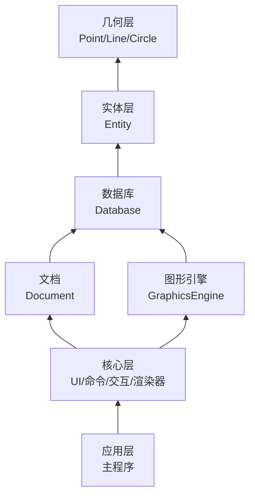

# CAD核心设计

在已经实现
- UI：负责绘制UI与相关UI逻辑触发
- 命令层：命令注册与执行
- 交互层：光标、键盘输入、选择等交互
- 渲染层：将图元数据渲染到视口中

这些CAD程序必不可少的骨架之后，还需要实现更加核心的东西，也就是：
- 实体数据层：各种类型实体的定义
- 实体数据库：保存图纸中的实体，一张图纸就是一个数据库
- 几何层：负责进行各种类型几何数据的计算
- 图形引擎：负责将实体数据库中的实体光栅化为保存在顶点缓冲中的图元数据，过程中会处理颜色、线型、线宽等属性，提供给渲染器绘制

相关流程：
- 持久化数据流：Database <-> Entity的序列化/反序列化(加载/保存)接口 <-> 文件
- 渲染流：Entity -> 图形引擎 -> 顶点缓冲 -> 基于OpenGL的渲染器绘制到视口上
- 交互流：UI/Command -> Database -> Entity创建修改等 -> 触发图形引擎重生成重新光栅化

## 模块划分

- TODO: 这个图可能需要修改。


模块划分：
- 几何层: Geometry
- 实体层：Entity
- 数据库：Database
- 图形引擎：GraphicsEngine

## 系统变量

目前实现涉及到的需要实现的：

软件级，跨会话跨文档共享：

- LWDEFAULT: 默认线宽

文档级，保存在文档中：

- LTSCALE: 线型比例

## 几何层

- 处理点、线段、直线、圆、圆弧、椭圆、各种样条曲线这些基础几何曲线，提供关于基础几何曲线的通用几何定义与通用几何算法。
- 样条曲线比较复杂，目前只实现基础数据结构，相关算法放在GeometryUtils模块调用第三方库来做。
- 以下功能足以覆盖90%简单几何场景，其他的用到时需要再来添加。

**一、基础类型**

| 类型 | 说明 | 存储数据 | 核心操作 |
|------|------|----------|----------|
| Point | 三维空间点 | x, y, z | 加减、数乘、距离、点积 |
| Vector | 三维向量 | x, y, z | 加减、数乘、点积、叉积、长度、归一化、夹角 |
| Matrix | 4x4 仿射变换矩阵 | 16个双精度数 | 平移、旋转、缩放、镜像、组合、求逆、点变换、向量变换 |

基础类型直接使用`glm`提供的结构，但使用Geometry层提供的别名，这样做可以进行代码层面解耦，将来要更改也很方便。

**二、基本图元**

| 图元 | 说明 | 存储数据 | 核心算法 |
|------|------|----------|----------|
| Segment | 线段 | 起点、终点 | 长度、中点、参数方程、点到线段距离、最近点、包含性、与线段交点、与圆交点 |
| Ray | 射线 | 原点、方向 | 参数方程、点到射线距离、最近点、与线段交点、与圆交点 |
| Line | 无限直线 | 原点、方向 | 点到直线距离、投影（垂足）、与直线交点、与圆交点 |
| Circle | 圆 | 中心、法向量、半径 | 面积、周长、点到圆距离、最近点、包含性、与直线交点、与圆交点、切线 |
| Arc | 圆弧 | 中心、法向量、半径、起始角、终止角 | 弧长、参数方程、点到圆弧距离、包含性、细分 |
| Ellipse | 椭圆 | 中心、法向量、长短轴半径、旋转角 | 面积、点到椭圆距离、参数方程、切线 |
| BezierCurve | 贝塞尔曲线 | 次数、控制点列表 | 求值、求导、细分、分割、升阶、降阶 |
| BSplineCurve | B样条曲线 | 次数、节点向量、控制点列表 | 求值、求导、插入节点、细分 |
| NURBSCurve | NURBS曲线 | 次数、节点向量、控制点、权重 | 求值、求导、插入节点、细分、有理变换 |

**三、复合图元**

| 图元 | 说明 | 存储数据 | 核心算法 |
|------|------|----------|----------|
| Polyline | 多段线 | 点列表 | 长度、封闭性、点到多段线距离、插入点、删除点 |
| Polygon | 多边形 | 点列表 | 面积、周长、凸性判断、点在多边形内、多边形相交 |
| Rect | 轴对齐矩形 | 左下点、右上点 | 面积、四个顶点、边、包含性 |
| RegularPolygon | 正多边形 | 中心、半径、边数、旋转角 | 顶点列表、面积 |

**四、辅助结构**

| 结构 | 说明 | 存储数据 | 核心算法 |
|------|------|----------|----------|
| AABB | 轴对齐包围盒 | 最小点、最大点 | 合并、扩展、包含性、相交性、中心、尺寸 |
| OBB | 有向包围盒 | 中心、半轴向量、旋转 | 包含性、相交性 |
| BoundingSphere | 球形包围盒 | 中心、半径 | 包含性、相交性 |

**五、交点计算**

**直线相交结果结构体**

segment/line/ray 相交函数返回 `LineIntersectionResult` 结构体：

```cpp
struct LineIntersectionResult {
    enum Type {
        kNone,           // 无交点（异面或平行不共线）
        kSinglePoint,    // 有一个交点
        kOverlapSegment, // 有重叠线段
        kOverlapRay,     // 有重叠射线
        kOverlapLine     // 有重叠直线（两直线共线）
    };
    
    Type type;          // 相交类型
    Point p1;           // 第一个点（交点或重叠起点）
    Point p2;           // 第二个点（重叠终点，仅 OverlapSegment 使用）
    Vector direction;   // 方向向量（OverlapRay/OverlapLine 使用）
};
```

**各函数返回值分析**

| 函数对 | 无交点 | 交点 | 重叠线段 | 重叠射线 | 重叠直线 |
|--------|--------|------|----------|----------|----------|
| Segment-Segment | ✅ | ✅ | ✅ | ❌ | ❌ |
| Segment-Line | ✅ | ✅ | ✅ | ❌ | ❌ |
| Segment-Ray | ✅ | ✅ | ✅ | ❌ | ❌ |
| Line-Line | ✅ | ✅ | ❌ | ❌ | ✅ |
| Line-Ray | ✅ | ✅ | ❌ | ✅ | ❌ |
| Ray-Ray | ✅ | ✅ | ✅ | ✅ | ❌ |

**说明**：线段是有限的，与任何类型重叠都只能返回 `kOverlapSegment`。射线与射线重叠：方向相同返回 `kOverlapRay`，方向相反返回 `kOverlapSegment`。

**其他相交函数**

| 输入 A | 输入 B | 输出 | 实现方式 |
|--------|--------|------|----------|
| Segment | Circle | 交点（0、1或2个） | 解析法 |
| Segment | Ellipse | 交点（0、1或多个） | 数值迭代法 |
| Line | Circle | 交点（0、1或2个） | 解析法 |
| Line | Ellipse | 交点（0、1或多个） | 数值迭代法 |
| Ray | Circle | 交点（0、1或2个） | 解析法 |
| Ray | Ellipse | 交点（0、1或多个） | 数值迭代法 |
| Circle | Circle | 交点（0、1或2个） | 解析法 |
| Circle | Ellipse | 交点（0、1或多个） | 数值迭代法 |
| Ellipse | Ellipse | 交点（0、1或多个） | 数值迭代法 |
| BezierCurve | Line | 交点（0、1或多个） | 迭代求解（待实现） |
| NURBSCurve | Line | 交点（0、1或多个） | 迭代求解（待实现） |

**实现方式说明：**

| 实现方式 | 精度 | 性能 | 适用场景 |
|----------|------|------|----------|
| 解析法 | 精确 | 快 | 线段、直线、射线、圆 |
| 数值迭代法 | 精确（1e-12） | 中 | 圆与椭圆、椭圆与椭圆 |
| 离散逼近法 | 近似（128段） | 快 | 涉及椭圆的快速求交（预览、选择） |
| 迭代求解 | 精确 | 慢 | 贝塞尔曲线、NURBS曲线（待实现） |

**六、距离计算**

| 输入 A | 输入 B | 输出 |
|--------|--------|------|
| Point | Point | 距离 |
| Point | Segment | 最短距离 |
| Point | Line | 垂直距离 |
| Point | Ray | 最短距离 |
| Point | Circle | 最短距离（内外） |
| Point | Ellipse | 最短距离（近似） |
| Point | BezierCurve | 最短距离 |
| Segment | Segment | 最短距离 |
| Segment | Circle | 最短距离 |
| Circle | Circle | 圆心距 |

**七、投影计算**

| 输入 | 到 | 输出 |
|------|----|------|
| Point | Line | 垂足（投影点） |
| Point | Segment | 最近点（可能在延长线上） |
| Point | Circle | 最近点（圆上） |
| Point | BezierCurve | 最近点（参数值） |

**八、切线计算**

| 输入 | 输出 | 说明 |
|------|------|------|
| Circle、angle | Vector | 圆上某角度的切线方向 |
| Circle、Point | Vector | 圆上某点的切线方向（调用者保证点在圆上且共面） |
| Circle、externalPoint | 切点列表 | 过圆外一点的切点（调用者保证共面） |
| Ellipse、t | Vector | 椭圆上某参数的切线方向 |
| Ellipse、Point | Vector | 椭圆上某点的切线方向（调用者保证点在椭圆上且共面） |

**九、包含性测试**

| 输入 | 被包含于 | 输出 |
|------|----------|------|
| Point | Segment | 是否在线段上（含端点） |
| Point | Ray | 是否在射线上（含端点） |
| Point | Circle | 是否在圆内（含边界） |
| Point | Ellipse | 是否在椭圆内（含边界） |
| Point | Polygon | 是否在多边形内（含边界） |
| Point | BezierCurve | 是否在曲线上（给定容差） |
| Segment | Circle | 是否完全在圆内 |
| Circle | Circle | 是否内含 |

**十、共线/共面检查**

| 输入 | 输出 | 说明 |
|------|------|------|
| Point、Line | bool | 点是否在直线上 |
| Line、Line | bool | 两条直线是否共线 |
| Line、Line | bool | 两条直线是否共面 |
| Line、Curve(Circle/Ellipse) | bool | 直线与圆/椭圆是否共面 |
| Curve、Curve | bool | 两个圆/椭圆是否共面 |

**十一、角度计算**

| 输入 | 输出 | 说明 |
|------|------|------|
| Vector、Vector | 弧度 | 两向量夹角 [0, π] |
| Point、Point、Point | 弧度 | 三点形成的角 [0, π] |
| Vector | 弧度 | 向量与 X 轴夹角 [0, 2π) |

**十二、曲线细分**

| 输入 | 输出 | 用途 |
|------|------|------|
| Circle | 线段序列 | 渲染 |
| Ellipse | 线段序列 | 渲染 |
| Arc | 线段序列 | 渲染 |
| BezierCurve | 线段序列 | 渲染 |
| BSplineCurve | 线段序列 | 渲染 |
| NURBSCurve | 线段序列 | 渲染 |

**十三、几何变换**

| 变换类型 | 输入 | 输出 |
|----------|------|------|
| 平移 | 点/向量、位移 | 变换后的点/向量 |
| 旋转 | 点/向量、轴、角度 | 变换后的点/向量 |
| 缩放 | 点/向量、缩放因子 | 变换后的点/向量 |
| 镜像 | 点/向量、镜像平面 | 变换后的点/向量 |
| 组合 | 多个变换矩阵 | 复合变换矩阵 |
| 求逆 | 变换矩阵 | 逆变换矩阵 |

**镜像变换详细说明：**

| 函数 | 说明 |
|------|------|
| mirrorPoint(p, planeOrigin, planeNormal) | 点关于平面镜像（3D通用） |
| mirrorVector(v, planeNormal) | 向量关于平面镜像（3D通用） |
| mirrorXY(v) | 关于 XY 平面镜像（Z反向） |
| mirrorXZ(v) | 关于 XZ 平面镜像（Y反向） |
| mirrorYZ(v) | 关于 YZ 平面镜像（X反向） |
| mirrorX(v) | 关于 X 轴镜像（2D，等价于 mirrorXZ） |
| mirrorY(v) | 关于 Y 轴镜像（2D，等价于 mirrorYZ） |
| mirrorCenter(v, center) | 关于中心点镜像 |
| mirrorCenter(v) | 关于原点镜像 |

**十三、精度控制**

| 项目 | 值 | 说明 |
|------|----|------|
| ABSOLUTE_TOLERANCE | 1e-9 | 绝对精度，用于距离比较、重合判断等 |
| RELATIVE_TOLERANCE | 1e-12 | 相对精度，用于大坐标大数据判断（1e6以上） |
| ANGLE_TOLERANCE | 1e-8 弧度 | 角度比较容差 |

- 定义为 `Tolerance` 结构体，包含 `absolute`、`relative`、`angle` 三个字段
- 提供三组预设：`Tolerance::Default`（默认）、`Tolerance::Loose`（宽松）、`Tolerance::Strict`（严格）
- 所有比较函数（`isEqual`、`isZero`、`isCoincident` 等）都接受可选的 `Tolerance` 参数
- 混合精度策略：小数值使用绝对精度，大数值自动切换为相对精度

**十四、依赖关系**

| 依赖项 | 类型 | 说明 |
|--------|------|------|
| C++ 标准库 | 编译依赖 | 基础语言支持、容器 |
| glm | 编译依赖 | 向量、矩阵数学运算 |

**十五、不包含的内容**

| 内容 | 原因 |
|------|------|
| 颜色 | 属于渲染属性 |
| 图层 | 属于文档管理 |
| 线型 | 属于显示属性 |
| 实体 ID | 属于实体标识 |
| 选择状态 | 属于交互状态 |
| 渲染代码 | 属于渲染层 |
| UI 代码 | 属于界面层 |
| 文件 I/O | 属于持久化层 |

**十六、设计原则**

| 原则 | 说明 |
|------|------|
| 单一职责 | 只负责几何定义和计算 |
| 无外部依赖 | 不依赖 OpenGL、ImGui、文件系统 |
| 精确性优先 | double 精度，严格控制误差 |
| 三维完整 | 完整支持三维，上层按需使用 |
| 值语义 | 对象可复制，无虚函数 |
| 无状态 | 纯函数，不存储上下文 |
| 线程安全 | 所有函数可并发调用 |


## CAD特定几何算法

- 放在GeometryUtils模块，依赖实体层与几何层，提供给命令层或者选择捕捉等框架使用。
- 处理非简单几何曲线的复杂几何算法，部分实现需要依赖第三方库提供。
- 例如：多边形布尔、多边形偏移、三角剖分、NURBS曲线（定义在Geometry，算法在GeometryUtils）相关操作等。
- 目前暂无，后续需要时再来实现。

## 数据库与实体层

概述：
- 数据库和实体层定义在同一个模块中。数据库负责保存实体，对应到一张图纸，一个CAD文档。图纸中每一个图形则关联到具体的实体对象和类型。
- 简单实体直接包含一个`Geometry::xxx`对象，数据从中获取，几何计算时直接调用进行计算。
- 复合实体比如多段线则保存顶点，需要进行几何计算时构造`Geometry::xxx`对象进行计算。

**数据库**：
- 结构：
```
Database
├── Entities (图形实体)
├── Layers (图层)
├── Linetypes (线型)
├── TextStyles (文字样式)
├── DimStyles (标注样式)
├── Blocks (块定义)
├── Groups (组)
├── UCSTable (用户坐标系表)
├── Layouts (布局)
├── PlotSettings (打印设置)
├── NamedObjectsDictionary (命名对象字典)
│   └── Variables (系统变量)
├── XRecords (扩展数据记录)
└── ApplicationData (应用程序自定义数据)
```
- 先实现实体、图层、线型、命名对象字典4个表，其他后续逐步添加。
- 序列化：实现为json文件格式，通过rapidjson库读取。

**实体与对象**：

- 所有保存在数据库中的数据都派生自`DbObject`，其中实现RTTI，`id`相关接口，`clone`接口。
- `DbEntity`是所有可绘制图形的父类，
- 所有可绘制图形都派生自`DbEntity`：
    - 其中维护图形通用数据：图层、颜色、线型、线型比例、线宽、可见性。
    - 定义纯虚函数获取包围盒，所以子类都需要实现。
- 具体图形类派生`DbEntity`并实现各自的几何数据：
    - 简单图形：线段、直线、射线、圆、椭圆直接包含对应几何对象。
    - 复杂图形：多段线等则保存一系列点等数据。
- 数据格式与序列化：图形使用json数据，rapidjson库用来实例化。所有数据都使用整数(枚举、索引、id等)、浮点数(坐标、长度等)或者字符串(比如名称)保存。
- 数据示例：
```C++
{
    "type": 2, // DbObject::kCircle
    "typeString": "Circle", // 用于人的阅读，实际type就足够表示类型
    "id": 1001, // object id
    "layerId": 0,
    "color": [0], // [type, rgb?]
    "linetype": [2], // [type, id?]
    "linetypeScale": 1.0,
    "lineWeight": -1, // 特殊值表示ByLayer
    "visible": true,
    "center": [50.0, 50.0, 0.0], // [x, y, z]
    "radius": 25.0
}
```

**图层**：
- 两种状态：冻结与锁定，相互正交。

冻结|锁定|显示|可选择|可编辑|参与计算（重生/缩放/求交等）
-------|-------|-------|-------|-------|-------
❌|❌|✅ 正常|✅|✅|✅
❌|✅|✅ 变灰/半透明|✅|❌|✅
✅|❌/✅|❌|❌|❌|❌（完全跳过）

- 属性：名称、颜色、线型、线宽、透明度、说明。


## Undo/Redo设计

经过慎重考虑，决定采用增量变更+实体备份这种方案来完成：
- 增量变更：
    - 这是轻量高频多实体操作的处理方案。
    - 主要用于属性栏修改属性、夹点编辑等简单修改属性的变更操作。
    - 通过记录变更的属性、源值、新值、参与变更的所有实体id即可，通过批量设置实体属性即可完成undo操作。
    - 需要侵入实体，实体需要实现setProperty(DbPropertyId::kCertainProperty, propValue)这种方法。
- 实体备份：
    - 这是统一、通用的最终方案。
    - 主要用于命令中的实体修改。
    - 记录一个UndoGroup(undo操作的单位，一般是命令或者其他被包装成一个UndoGroup的一群操作)中涉及到的所有实体修改、实体删除、实体添加。实体修改会被备份、删除会被保留，并被分配新id并记录对应源id。添加的实体同样会被记录为一个id列表。
    - undo执行时：所有新添加实体被标记删除(修改id到对应区间)，所有备份实体被恢复为活跃状态，id恢复为记录下的对应源id。
    - 备份实体只存在于一个会话中，不需要序列化，保存重新打开后丢失。
- 实体备份事实上足以处理所有情况，但是针对大量实体的属性修改可能会造成大量实体备份同时存在(例如100次连续选择100个实体修改属性会造成10000个实体备份，而增量修改方案则几乎没有什么内存消耗也不需要频繁克隆)。所以对轻量高频的属性修改进行优化以实现内存、性能、可用性的最优化方案。

具体细节：
- Undo栈保存在Document中对应于该Database，超过100次的记录会被丢弃。
- undo执行后redo栈新增一条记录，记录与上一条undo栈相反的信息(或者不需要存储反向信息，直接用undo记录推导redo操作就行，undo/redo时记录在undo/redo栈之间移动就行，一个动态数组配合移动的索引即可实现)。新的undo操作开始记录(beginUndoGroup)会让redo栈丢弃现有所有记录。
- 数据库Database中提供标记删除的功能，而具体的实体克隆则由Undo框架来完成。
```C++
// 参考
class UndoManager {
public:
    void beginUndoGroup();
    void endUndoGroup();
    void recordModify(ObjectId id);
    void recordDelete(ObjectId id);
    void recordCreate(ObjectId id);
};
```
- 命令层需要在任何涉及数据库修改的地方调用对应的函数记录修改，方便Undo框架生成与管理备份对象。
- 最终一组`beginUndoGroup/endUndoGroup`的所有操作被记录为一个Undo栈中的一个`UndoRecord`，`undo/redo`命令通过管理这个栈执行变更来实现撤销重做操作。如果整个`beginUndoGroup/endUndoGroup`期间没有任何记录，则不会生成`UndoRecord`。
- 而属性修改对应的undo记录则比较简单，只需要一个Id列表、属性原值与修改后的值即可，后续属性栏实现时再来补充。
