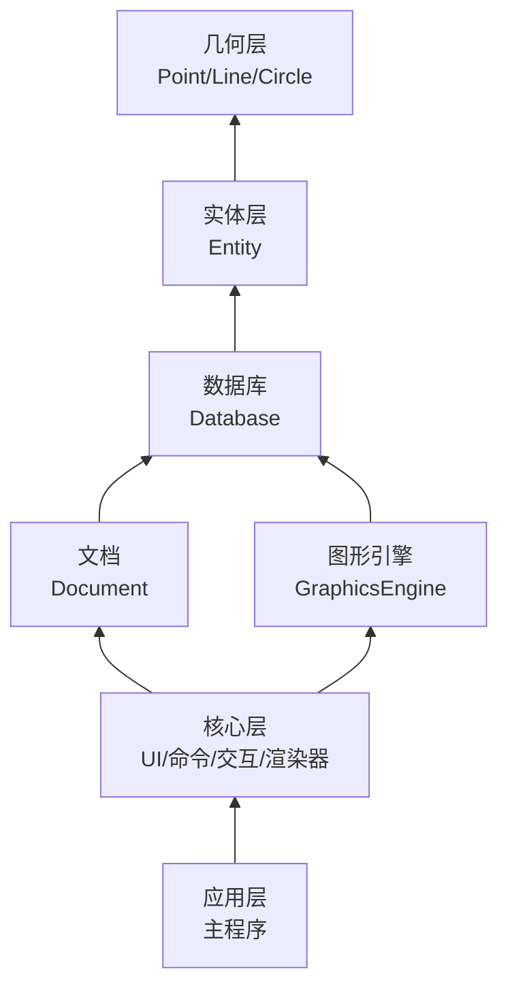

# CAD核心设计

在已经实现
- UI：负责绘制UI与相关UI逻辑触发
- 命令层：命令注册与执行
- 交互层：光标、键盘输入、选择等交互
- 渲染层：将图元数据渲染到视口中

这些CAD程序必不可少的骨架之后，还需要实现更加核心的东西，也就是：
- 实体数据层：各种类型实体的定义
- 实体数据库：保存图纸中的实体，一张图纸就是一个数据库
- 几何层：负责进行各种类型几何数据的计算
- 图形引擎：负责将实体数据库中的实体光栅化为保存在顶点缓冲中的图元数据，过程中会处理颜色、线型、线宽等属性，提供给渲染器绘制

相关流程：
- 持久化数据流：Database <-> Entity的序列化/反序列化(加载/保存)接口 <-> 文件
- 渲染流：Entity -> 图形引擎 -> 顶点缓冲 -> 基于OpenGL的渲染器绘制到视口上
- 交互流：UI/Command -> Database -> Entity创建修改等 -> 触发图形引擎重生成重新光栅化

## 模块划分

- TODO: 这个图可能需要修改。

模块划分：
- 几何层: Geometry
- 实体层：Entity
- 数据库：Database
- 图形引擎：GraphicsEngine

## 几何层

- 处理点、线段、直线、圆、圆弧、椭圆、各种样条曲线这些基础几何曲线，提供关于基础几何曲线的通用几何定义与通用几何算法。
- 样条曲线比较复杂，目前只实现基础数据结构，相关算法放在GeometryUtils模块调用第三方库来做。

### 一、基础类型

| 类型 | 说明 | 存储数据 | 核心操作 |
|------|------|----------|----------|
| Point | 三维空间点 | x, y, z | 加减、数乘、距离、点积 |
| Vector | 三维向量 | x, y, z | 加减、数乘、点积、叉积、长度、归一化、夹角 |
| Matrix | 4x4 仿射变换矩阵 | 16个双精度数 | 平移、旋转、缩放、镜像、组合、求逆、点变换、向量变换 |

基础类型直接使用`glm`提供的结构，但使用Geometry层提供的别名，这样做可以进行代码层面解耦，将来要更改也很方便。

### 二、基本图元

| 图元 | 说明 | 存储数据 | 核心算法 |
|------|------|----------|----------|
| Segment | 线段 | 起点、终点 | 长度、中点、参数方程、点到线段距离、最近点、包含性、与线段交点、与圆交点 |
| Ray | 射线 | 原点、方向 | 参数方程、点到射线距离、最近点、与线段交点、与圆交点 |
| Line | 无限直线 | 原点、方向 | 点到直线距离、投影（垂足）、与直线交点、与圆交点 |
| Circle | 圆 | 中心、法向量、半径 | 面积、周长、点到圆距离、最近点、包含性、与直线交点、与圆交点、切线 |
| Arc | 圆弧 | 中心、法向量、半径、起始角、终止角 | 弧长、参数方程、点到圆弧距离、包含性、细分 |
| Ellipse | 椭圆 | 中心、法向量、长短轴半径、旋转角 | 面积、点到椭圆距离、参数方程、切线 |
| BezierCurve | 贝塞尔曲线 | 次数、控制点列表 | 求值、求导、细分、分割、升阶、降阶 |
| BSplineCurve | B样条曲线 | 次数、节点向量、控制点列表 | 求值、求导、插入节点、细分 |
| NURBSCurve | NURBS曲线 | 次数、节点向量、控制点、权重 | 求值、求导、插入节点、细分、有理变换 |

### 三、复合图元

| 图元 | 说明 | 存储数据 | 核心算法 |
|------|------|----------|----------|
| Polyline | 多段线 | 点列表 | 长度、封闭性、点到多段线距离、插入点、删除点 |
| Polygon | 多边形 | 点列表 | 面积、周长、凸性判断、点在多边形内、多边形相交 |
| Rect | 轴对齐矩形 | 左下点、右上点 | 面积、四个顶点、边、包含性 |
| RegularPolygon | 正多边形 | 中心、半径、边数、旋转角 | 顶点列表、面积 |

### 四、辅助结构

| 结构 | 说明 | 存储数据 | 核心算法 |
|------|------|----------|----------|
| AABB | 轴对齐包围盒 | 最小点、最大点 | 合并、扩展、包含性、相交性、中心、尺寸 |
| OBB | 有向包围盒 | 中心、半轴向量、旋转 | 包含性、相交性 |
| BoundingSphere | 球形包围盒 | 中心、半径 | 包含性、相交性 |

### 五、交点计算

| 输入 A | 输入 B | 输出 | 实现方式 |
|--------|--------|------|----------|
| Segment | Segment | 交点（0、1或多个） | 解析法 |
| Segment | Line | 交点（0或1个） | 解析法 |
| Segment | Ray | 交点（0或1个） | 解析法 |
| Segment | Circle | 交点（0、1或2个） | 解析法 |
| Segment | Ellipse | 交点（0、1或多个） | 数值迭代法 |
| Line | Line | 交点（0或1个） | 解析法 |
| Line | Ray | 交点（0或1个） | 解析法 |
| Line | Circle | 交点（0、1或2个） | 解析法 |
| Line | Ellipse | 交点（0、1或多个） | 数值迭代法 |
| Ray | Ray | 交点（0或1个） | 解析法 |
| Ray | Segment | 交点（0或1个） | 解析法 |
| Ray | Line | 交点（0或1个） | 解析法 |
| Ray | Circle | 交点（0、1或2个） | 解析法 |
| Ray | Ellipse | 交点（0、1或多个） | 数值迭代法 |
| Circle | Circle | 交点（0、1或2个） | 解析法 |
| Circle | Line | 交点（0、1或2个） | 解析法 |
| Circle | Ray | 交点（0、1或2个） | 解析法 |
| Circle | Segment | 交点（0、1或2个） | 解析法 |
| Circle | Ellipse | 交点（0、1或多个） | 数值迭代法 |
| Ellipse | Ellipse | 交点（0、1或多个） | 数值迭代法 |
| Ellipse | Line | 交点（0、1或多个） | 数值迭代法 |
| Ellipse | Ray | 交点（0、1或多个） | 数值迭代法 |
| Ellipse | Segment | 交点（0、1或多个） | 数值迭代法 |
| Ellipse | Circle | 交点（0、1或多个） | 数值迭代法 |
| BezierCurve | Line | 交点（0、1或多个） | 迭代求解（待实现） |
| NURBSCurve | Line | 交点（0、1或多个） | 迭代求解（待实现） |

**实现方式说明：**

| 实现方式 | 精度 | 性能 | 适用场景 |
|----------|------|------|----------|
| 解析法 | 精确 | 快 | 线段、直线、射线、圆 |
| 数值迭代法 | 精确（1e-12） | 中 | 圆与椭圆、椭圆与椭圆 |
| 离散逼近法 | 近似（128段） | 快 | 涉及椭圆的快速求交（预览、选择） |
| 迭代求解 | 精确 | 慢 | 贝塞尔曲线、NURBS曲线（待实现） |

### 六、距离计算

| 输入 A | 输入 B | 输出 |
|--------|--------|------|
| Point | Point | 距离 |
| Point | Segment | 最短距离 |
| Point | Line | 垂直距离 |
| Point | Ray | 最短距离 |
| Point | Circle | 最短距离（内外） |
| Point | Ellipse | 最短距离（近似） |
| Point | BezierCurve | 最短距离 |
| Segment | Segment | 最短距离 |
| Segment | Circle | 最短距离 |
| Circle | Circle | 圆心距 |

### 七、投影计算

| 输入 | 到 | 输出 |
|------|----|------|
| Point | Line | 垂足（投影点） |
| Point | Segment | 最近点（可能在延长线上） |
| Point | Circle | 最近点（圆上） |
| Point | BezierCurve | 最近点（参数值） |

### 八、包含性测试

| 输入 | 被包含于 | 输出 |
|------|----------|------|
| Point | Segment | 是否在线段上（含端点） |
| Point | Circle | 是否在圆内（含边界） |
| Point | Ellipse | 是否在椭圆内（含边界） |
| Point | Polygon | 是否在多边形内（含边界） |
| Point | BezierCurve | 是否在曲线上（给定容差） |
| Segment | Circle | 是否完全在圆内 |
| Circle | Circle | 是否内含 |

### 九、曲线细分

| 输入 | 输出 | 用途 |
|------|------|------|
| Circle | 线段序列 | 渲染 |
| Ellipse | 线段序列 | 渲染 |
| Arc | 线段序列 | 渲染 |
| BezierCurve | 线段序列 | 渲染 |
| BSplineCurve | 线段序列 | 渲染 |
| NURBSCurve | 线段序列 | 渲染 |

### 十、几何变换

| 变换类型 | 输入 | 输出 |
|----------|------|------|
| 平移 | 点/向量、位移 | 变换后的点/向量 |
| 旋转 | 点/向量、轴、角度 | 变换后的点/向量 |
| 缩放 | 点/向量、缩放因子 | 变换后的点/向量 |
| 镜像 | 点/向量、镜像轴 | 变换后的点/向量 |
| 组合 | 多个变换矩阵 | 复合变换矩阵 |
| 求逆 | 变换矩阵 | 逆变换矩阵 |

### 十一、精度控制

| 项目 | 值 | 说明 |
|------|----|------|
| ABSOLUTE_TOLERANCE | 1e-9 | 绝对精度，用于距离比较、重合判断等 |
| RELATIVE_TOLERANCE | 1e-12 | 相对精度，用于大坐标大数据判断（1e6以上） |
| ANGLE_TOLERANCE | 1e-8 弧度 | 角度比较容差 |

- 定义为 `Tolerance` 结构体，包含 `absolute`、`relative`、`angle` 三个字段
- 提供三组预设：`Tolerance::Default`（默认）、`Tolerance::Loose`（宽松）、`Tolerance::Strict`（严格）
- 所有比较函数（`isEqual`、`isZero`、`isCoincident` 等）都接受可选的 `Tolerance` 参数
- 混合精度策略：小数值使用绝对精度，大数值自动切换为相对精度

### 十二、依赖关系

| 依赖项 | 类型 | 说明 |
|--------|------|------|
| C++ 标准库 | 编译依赖 | 基础语言支持、容器 |
| glm | 编译依赖 | 向量、矩阵数学运算 |

### 十三、不包含的内容

| 内容 | 原因 |
|------|------|
| 颜色 | 属于渲染属性 |
| 图层 | 属于文档管理 |
| 线型 | 属于显示属性 |
| 实体 ID | 属于实体标识 |
| 选择状态 | 属于交互状态 |
| 渲染代码 | 属于渲染层 |
| UI 代码 | 属于界面层 |
| 文件 I/O | 属于持久化层 |

### 十四、设计原则

| 原则 | 说明 |
|------|------|
| 单一职责 | 只负责几何定义和计算 |
| 无外部依赖 | 不依赖 OpenGL、ImGui、文件系统 |
| 精确性优先 | double 精度，严格控制误差 |
| 三维完整 | 完整支持三维，上层按需使用 |
| 值语义 | 对象可复制，无虚函数 |
| 无状态 | 纯函数，不存储上下文 |
| 线程安全 | 所有函数可并发调用 |

## CAD特定几何算法

- 放在GeometryUtils模块，依赖实体层与几何层，提供给命令层或者选择捕捉等框架使用。
- 处理非简单几何曲线的复杂几何算法，部分实现需要依赖第三方库提供。
- 例如：多边形布尔、多边形偏移、三角剖分、NURBS曲线（定义在Geometry，算法在GeometryUtils）相关操作等。

## 实体层

- 简单实体直接包含一个`Geometry::xxx`对象，数据从中获取，几何计算时直接调用进行计算。
- 复合实体比如多段线则保存顶点，需要进行几何计算时构造`Geometry::xxx`对象进行计算。

## 数据库

